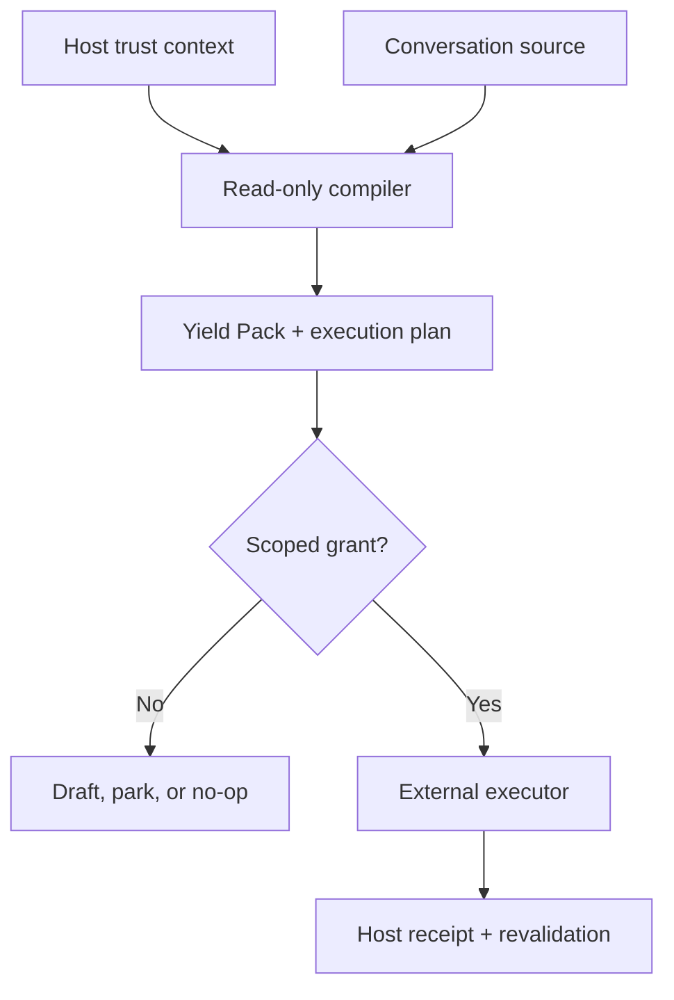

# Quirk Conversation Compiler

Conversation is source material. The compiler turns its consequential delta
into typed, traceable, repo-safe Quirk Objects without pretending every good
idea became canon.

The naming is deliberately split:

| Surface       | Name                            | Job                                                 |
| ------------- | ------------------------------- | --------------------------------------------------- |
| System        | **Quirk Conversation Compiler** | Distills, reconciles, routes, builds, and evaluates |
| Invocation    | **Quirk Wrap**                  | Human command for running the capability            |
| Capability ID | `quirk.conversation.compile`    | Stable machine identity                             |
| Output        | **Conversation Yield Pack**     | Durable, reviewable result                          |

This is not a transcript summarizer. A good run can return a no-op. A strong
conversation does not automatically justify a new file, and an attractive
assistant proposal does not become Quirk canon because it sounded finished.

## Operating boundary

Distillation may be automatic. Canonization and external mutation require
authority. Git receives accepted objects, contracts, curated fixtures, and
decisions—not routine transcripts.

The pack cannot certify its own authority. The host supplies immutable,
hash-bound source metadata, exact statement-level canon grants, pinned
repository revisions and trees, scoped mutation grants, and executor receipts.
The model receives a disposable copy; validation retains a separate copy.

## Nine compiler stages

1. **Census** — map sources, decisions, corrections, constraints, proposals,
   tensions, and discarded branches.
2. **Distill** — isolate meaningful deltas; remove ceremony and repetition.
3. **Reconcile** — make late corrections win, preserve contradictions, and
   prevent assistant-originated canon.
4. **Objectify** — assign type, owner, interfaces, lifecycle, provenance,
   permissions, failure states, and evaluation.
5. **Synthesize** — connect surviving fragments without flattening useful
   distinctions or cloning existing machinery.
6. **Route** — inspect pinned repository snapshots, detect portable path and
   declared-identity collisions, and select the smallest correct home.
7. **Build** — create the minimum coherent artifact set in the authorized mode.
8. **Evaluate** — run hard gates, score quality, report omissions, and hand off
   validation evidence.
9. **Handoff** — render the schema-valid Yield Pack for the current surface and
   name one decisive next move.

## Object families

| Family      | Examples                                                             | Consequence                           |
| ----------- | -------------------------------------------------------------------- | ------------------------------------- |
| Source      | `SourceReference`, `EvidenceLink`                                    | Provenance without transcript dumping |
| Meaning     | `Claim`, `Preference`, `Decision`, `Correction`, `Contradiction`     | What changed and who has authority    |
| Design      | `Definition`, `Contract`, `Schema`, `ADR`, `Spec`                    | Stable structure                      |
| Execution   | `Prompt`, `Skill`, `Capability`, `Tool`, `Workflow`, `Snippet`       | Runnable behavior                     |
| Proof       | `Eval`, `Fixture`, `Metric`, `AcceptanceCriterion`, `EvidenceRecord` | What makes the result credible        |
| Publication | `READMESection`, `Essay`, `ResourceIndex`, `Example`                 | Independent legibility                |
| Incubation  | `Idea`, `Hypothesis`, `Experiment`, `OpenQuestion`                   | Honest unfinished leverage            |
| Holding     | `BoneyardEntry`, `Tombstone`, `Supersession`                         | Recoverable displaced value           |
| Delivery    | `RepoTarget`, `ChangeProposal`, `ChangeSet`, `ReleaseNote`           | Exact mutation plan                   |

“Genius” is a signal, not an object type. Mark an appropriately typed object
`exceptional` and record why. Otherwise genius becomes the drawer where rigor
goes to die.

## Routing defaults

| Signal                        | Default destination                        |
| ----------------------------- | ------------------------------------------ |
| Stable definition or doctrine | canon or capability documentation          |
| Consequential choice          | ADR or decision log                        |
| Reusable instruction          | prompt library or skill                    |
| Executable behavior           | capability, tool, workflow, or domain code |
| Quality standard              | eval, fixture, or acceptance criteria      |
| Contract                      | schema, type, interface, and example       |
| Sustained argument            | essay                                      |
| Unproven possibility          | incubator                                  |
| Rejected or superseded value  | boneyard                                   |
| No durable delta              | no-op receipt                              |

Prefer updating an existing object over creating a near-duplicate. Cross-repo
spraying is a failure state, not evidence of productivity.

## Promotion lifecycle

`captured → distilled → typed → reconciled → proposed → reviewed → canonicalized → enforced → projected → verified → observed`

Review may branch to:

- `park` — incubator until evidence or a dependency changes;
- `reject` — boneyard when the failure retains learning;
- `discard` — delete noise or material unsafe to retain;
- `supersede` — preserve lineage and point to the replacement.

This keeps canonical definitions, runtime enforcement, and database
projections separate. Conversation prose never leaks directly into runtime
authority.

## Trust and execution split

| Claim                       | Required trusted input                                                              | Compiler behavior                                      |
| --------------------------- | ----------------------------------------------------------------------------------- | ------------------------------------------------------ |
| Source exists               | Exact source record plus SHA-256 content hash                                       | Output must echo every field exactly                   |
| Statement is CANON          | Source-compatible, exact statement grant                                            | Generic instructions cannot canonize                   |
| Path is available           | Pinned revision, tree, and complete entry inventory                                 | Checks case, Unicode, and file/tree-prefix equivalence |
| Mutation is allowed         | Current user instruction plus scoped mode/action/repository/path grant              | Prepares the plan but does not execute                 |
| Mutation happened or failed | Host-owned receipt bound to action, identity, typed delivery, and base/result state | Permits the truthful terminal result                   |

The deterministic semantic check covers declared `semanticKey` identities. It
does not claim to solve arbitrary semantic equivalence; the independent eval
corpus and human review own that broader judgment. The executor must reject a
stale revision or tree immediately before writing.

There are two honest output lanes. Complete host context permits a validated
machine pack. Missing trust inputs permit only a provisional human report: no
invented source IDs, no guessed boundary Boolean, no machine evaluation object,
and no structural or release claim.

The callable returns a `compileRunResult` envelope; a successful pack lives at
`validation.pack`. With no pinned repository snapshot, the machine pack cannot
route artifacts. A run-level `disposition: no_op` carries empty artifact and
change sets, so an honest no-op never needs a fake repository path. Drafted
results carry complete typed delivery rather than an unevidenced status label.

The JSON Schema owns structural interchange checks. The runtime adds semantic
host checks that JSON Schema cannot express cleanly: trusted-authority
compatibility, exact allowlist-to-snapshot correspondence, portable canonical
uniqueness, mutation-grant scope, and execution-receipt binding.

## Pack contents

| Artifact                                                                                       | Purpose                                                         |
| ---------------------------------------------------------------------------------------------- | --------------------------------------------------------------- |
| [`PROMPT.md`](../../../prompts/library/conversational-wrap-up/PROMPT.md)                       | Provider-neutral canonical prompt                               |
| [`SKILL.md`](../../../skills/conversational-wrap-up/SKILL.md)                                  | Agent operating procedure                                       |
| [`capability.yaml`](../../../capabilities/conversation-to-repository/capability.yaml)          | Capability contract and permissions                             |
| [`conversation-yield.schema.json`](../../../schemas/conversation-yield.schema.json)            | Compile-request and Yield Pack interchange contract             |
| [`conversation-compiler.ts`](../../../src/lib/quirk/conversation-compiler.ts)                  | Provider-neutral compile/repair runner and structural validator |
| [`rubric.yaml`](../../../evals/conversation-compiler/rubric.yaml)                              | Hard gates, weighted score, and release policy                  |
| [`canon-boundary.yaml`](../../../evals/conversation-compiler/fixtures/canon-boundary.yaml)     | Adversarial correction and false-canon fixture                  |
| [`README.md`](../../../boneyard/conversation-compiler/README.md)                               | Governed burial and resurrection policy                         |
| [Conversation Should Have Consequences](../../essays/conversation-should-have-consequences.md) | Design argument and next extensions                             |

## Promotion target

The current pack is a proposed capability with a callable structured-output
runner and deterministic structural validator. Structural validity is not a
release decision. Promotion requires the independent eval corpus to prove every
hard gate, at least 92/100 weighted quality, complete correction and
contradiction recall, and no semantic delta on an unchanged rerun. File count
earns nothing.

Every one of the eleven gates must be `pass` for the compiler self-assessment
to meet promotion thresholds. A gate without a material target passes only
after the empty set is verified; `not_applicable` never counts as a pass. Gate
labels and quality scores do not determine structural validity, and the
validator always reports the release decision as `not_evaluated`.

Golden means the strongest surviving value is accurate, findable, reusable,
correctly routed, and independently understandable without Bryan standing
beside it explaining the whole damn thing.
