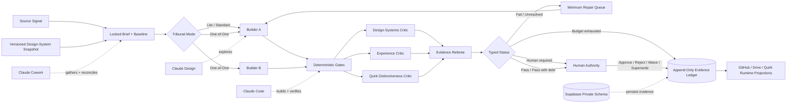

# Design Tribunal System Map

```mermaid
flowchart LR
  S[Source Signal] --> B[Locked Brief + Baseline]
  DS[Versioned Design-System Snapshot] --> B
  B --> M{Tribunal Mode}
  M -->|Lite / Standard| A[Builder A]
  M -->|One-of-One| A
  M -->|One-of-One| C[Builder B]
  A --> G[Deterministic Gates]
  C --> G
  G --> SC[Design-Systems Critic]
  G --> EC[Experience Critic]
  G --> QC[Quirk Distinctiveness Critic]
  SC --> R[Evidence Referee]
  EC --> R
  QC --> R
  R --> D{Typed Status}
  D -->|Fail / Unresolved| Q[Minimum Repair Queue]
  Q --> A
  D -->|Budget exhausted| L[(Append-Only Evidence Ledger)]
  D -->|Human required| H[Human Authority]
  D -->|Pass / Pass with debt| H
  H -->|Approve / Reject / Waive / Supersede| L
  L --> P[GitHub / Drive / Quirk Runtime Projections]

  CD[Claude Design] -. explores .-> A
  CC[Claude Code] -. builds + verifies .-> G
  CW[Claude Cowork] -. gathers + reconciles .-> B
  SP[(Supabase Private Schema)] -. persists evidence .-> L
```
