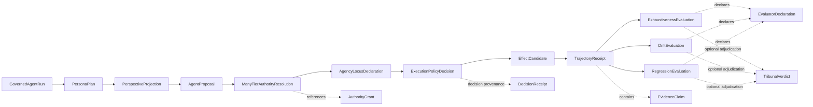

# Governed Agent Run Protocol

**Status:** DESIGN (Mode A implementation target)  
**Scope:** Canonical run protocol for Quirk agent actions  
**Closes:** Quirk-Systems/project-scaffold#100

## Objective

Define the canonical protocol that carries an agent action from persona/context configuration through authority, agency-locus, execution policy, effect candidacy, receipts, and post-run evaluation.

Locked maturity ladder:

```text
A. STATE_ONLY
→ B. REVERSIBLE_SANDBOX
→ C. PRODUCTION_GATED
```

Mode **A** is the immediate implementation target. Mode **B** is the first adversarial integration proof. Mode **C** is unavailable until durable runtime ports and independent approvals required by `Quirk-Systems/project-scaffold#98` at head `58d73b083293b745c126b2031b4295e74417e1d5` exist.

## Dependencies and composition boundaries

This protocol composes with (and does not redefine):

- `AuthorityGrant`
- `EvaluatorDeclaration`
- `EvidenceClaim`
- `TribunalVerdict`
- `DecisionReceipt`

It depends on:

- `#97` Quirk Authority & Evaluation Protocol
- `#98` Tribunal compatibility slice (exact head above)
- `#99` OSS Component Admission Contract
- existing Git-canonical / Supabase-projection posture
- existing `quirk_sync` receipts, proposed moves, manifest registry, transition ledger, and outbox projections

## Protocol spine

```text
PersonaPlan
→ PerspectiveProjection
→ AgentProposal
→ ManyTierAuthorityResolution
→ AgencyLocusDeclaration
→ ExecutionPolicyDecision
→ EffectCandidate
→ [mode-dependent effect boundary]
→ TrajectoryReceipt + EvidenceClaims
→ Exhaustiveness / Drift / Regression Evaluation
```

A thin `GovernedAgentRun` envelope binds exact versions, digests, policy snapshot, principals, grant references, and receipts across the chain.

## Canonical relationship graph



## Canonical object contracts

Each object has a single responsibility and digest boundary.

### 1) GovernedAgentRun (envelope)

- **Responsibility:** immutable run envelope and provenance root
- **Includes:** `runId`, `mode`, `protocolVersion`, `policySnapshotRef`, `principalSetRef`, `chainDigest`, `createdAt`, `supersedes?`
- **Digest boundary:** digest of ordered object digests (`PersonaPlan` → evaluations)

### 2) PersonaPlan

- **Responsibility:** selected persona configuration only
- **Must not include:** authority claims
- **Digest boundary:** persona id/version + prompt/template refs + constraints

### 3) PerspectiveProjection

- **Responsibility:** visible context projection
- **Must not imply:** permitted use
- **Digest boundary:** source refs, projection filters, projection timestamp

### 4) AgentProposal

- **Responsibility:** bounded proposal of intended transition/effect
- **Must not imply:** approval
- **Digest boundary:** intent, requested resources, bounded scope, expected outputs

### 5) ManyTierAuthorityResolution

- **Responsibility:** non-LLM authority resolution against current grants/policy
- **External composition:** references `AuthorityGrant` and `DecisionReceipt`
- **Digest boundary:** resolver implementation version, input refs, grant refs, denial/allow result

### 6) AgencyLocusDeclaration

- **Responsibility:** identifies actor locus (`human_directed`, `agent_assisted`, `agent_autonomous_disallowed`, etc.)
- **Must not alter:** authority
- **Digest boundary:** locus value + rationale refs

### 7) ExecutionPolicyDecision

- **Responsibility:** mode and policy gating decision
- **Must include:** explicit `effectExecutionAllowed`
- **Digest boundary:** mode, policy snapshot digest, decision result, required approvals

### 8) EffectCandidate

- **Responsibility:** exact candidate transition/effect description
- **Must not imply:** effect execution
- **Digest boundary:** write set, external endpoints, credentials class, rollback plan ref, idempotency key

### 9) TrajectoryReceipt

- **Responsibility:** immutable run trace and boundary outcomes
- **Composes:** `EvidenceClaim[]`
- **Digest boundary:** steps executed, validators/evaluators run, violations, timings, retries, cancellation state

### 10) ExhaustivenessEvaluation / DriftEvaluation / RegressionEvaluation

- **Responsibility:** post-run quality and trajectory checks only
- **Must not alter:** authority or effect permissions
- **Digest boundary:** evaluator declaration refs, findings, confidence, verdict

## State machine and mode transitions

```text
DRAFT
→ PROPOSED
→ AUTHORITY_RESOLVED
→ LOCUS_DECLARED
→ POLICY_DECIDED
→ CANDIDATE_BUILT
→ BOUNDARY_EVALUATED
→ RECEIPTS_EMITTED
→ EVALUATED
→ CLOSED
```

Terminal failures: `DENIED`, `TIMED_OUT`, `CANCELLED`, `INVALID_TRAJECTORY`.

Mode transitions are explicit and monotonic by run lineage:

- `STATE_ONLY` can promote to `REVERSIBLE_SANDBOX` only with `AtoBPromotionReceipt`.
- `REVERSIBLE_SANDBOX` can promote to `PRODUCTION_GATED` only with `BtoCPromotionReceipt` and independent approvals.
- No implicit mode carryover; each mode promotion starts from fresh state, fresh authority, fresh policy.
- No silent escalation: every transition requires explicit receipt and digest-linked parent run reference.

## Constitutional invariants + positive executable contracts

| Negative invariant | Positive executable contract (must pass) |
| --- | --- |
| persona selection ≠ authority | `contract_persona_requires_separate_authority_resolution` |
| visible context ≠ permitted use | `contract_projection_without_grant_denies_use` |
| proposal ≠ approval | `contract_proposal_without_decision_receipt_is_non_executable` |
| authority resolution must occur outside the LLM | `contract_authority_resolver_is_runtime_port_not_model_output` |
| role ≠ AuthorityGrant | `contract_role_without_grant_denied` |
| credential ≠ AuthorityGrant | `contract_credential_without_grant_denied` |
| EffectCandidate ≠ effect | `contract_candidate_only_does_not_execute_effect` |
| STATE_ONLY effectExecutionAllowed = false | `contract_state_only_policy_forces_effectExecutionAllowed_false` |
| sandbox authority cannot cross into production | `contract_sandbox_grants_rejected_in_production_gate` |
| successful sandbox effect ≠ production authority | `contract_sandbox_success_requires_fresh_production_resolution` |
| successful output cannot excuse invalid trajectory | `contract_invalid_trajectory_fails_even_with_successful_output` |
| confidence / consensus / evaluation cannot increase authority | `contract_evaluation_signals_do_not_mutate_authority` |

## Mode contracts

### Mode A — STATE_ONLY (implementation target)

Allowed:

- inspect permitted sources
- compose persona/perspective state
- propose bounded action
- resolve authority
- declare agency locus
- evaluate policy
- construct exact candidate transition
- run validators/evaluators/fixtures
- emit receipts

Forbidden:

- external writes
- production mutation
- canon mutation
- publication
- customer communication
- social posting
- payments
- secret-bearing side effects
- autonomous grant creation
- preparatory operations that themselves cause undeclared effects

Required final proof:

```text
Only candidate and evidence state changed.
No external effect executed.
```

### Mode B — REVERSIBLE_SANDBOX

- disposable isolated environment
- isolated credentials
- deny-by-default network
- exact write targets
- immutable logs
- runtime/cost/memory limits
- current grant recheck
- signed effect manifest
- tested rollback
- independent restoration verification

Adversarial proof must fail closed on attempts to:

- expand write set
- call unlisted endpoint
- reuse production credentials
- suppress rollback
- promote sandbox state to canon

Required receipts:

- `SandboxProvisionReceipt`
- `AuthorityRecheckReceipt`
- `EffectReceipt`
- `BoundaryViolationReceipt`
- `RollbackReceipt`
- `RestorationVerificationReceipt`

### Mode C — PRODUCTION_GATED

Requires:

- durable principal resolution
- issuer-bound key lifecycle
- evidence/candidate byte resolvers
- current policy snapshots
- receipt/replay state
- trusted transition-digest storage
- atomic compare-and-swap / outbox execution
- independent human/codeowner approval where applicable
- effect classification
- incident response hooks
- postcondition verification

Rule: passing A or B does not authorize C. Production effect needs fresh state, fresh authority, fresh policy, and a new decision receipt.

## Failure, timeout, retry, idempotency, cancellation

- **Fail closed** on missing/invalid authority, policy snapshot mismatch, unresolved principal, or boundary ambiguity.
- **Timeouts** emit typed timeout receipt with last safe boundary and no implicit continuation.
- **Retries** require same idempotency key and unchanged candidate digest; otherwise new run id.
- **Idempotency** key is mandatory for any mode beyond draft; repeated submissions return prior receipt.
- **Cancellation** emits cancellation receipt and stops before next boundary crossing; partial effects are invalid unless rollback and restoration receipts verify closure.

## Secret, privacy, and retention boundaries

- secrets never enter candidate/evidence payloads; only secret class references and access policy refs
- receipts store digests, not raw secret-bearing content
- logs are immutable append-only and redacted at ingest boundary
- retention classes: `run_core`, `evidence_refs`, `security_events`, `projection_views`
- projection stores (Supabase/Drive) remain non-canonical and can be rebuilt from Git + receipt store

## UI truth-bar contract

Any UI showing run state must display:

- mode badge (`STATE_ONLY`, `REVERSIBLE_SANDBOX`, `PRODUCTION_GATED`)
- authority status (`resolved/denied/stale`)
- effect boundary status (`candidate_only`, `sandbox_executed`, `production_executed`)
- required approvals outstanding
- latest receipt digest and verification status
- warning if trajectory invalid regardless of output success

UI must not infer authority from confidence, consensus, or pass-rate signals.

## GitHub canon and CI posture

- Git is canonical for protocol spec, fixtures, and executable contracts.
- CI must fail if mode escalation occurs without required promotion receipt.
- CI must fail if `STATE_ONLY` run emits effect receipt with executed external effect.
- CI must preserve append-only receipt evidence for audit.
- Any governance contract changes require review visibility and digest-diff trace.

## Supabase projection-only schema plan

Supabase stores query projections only; never canonical authority/evidence truth.

Proposed projection tables/views:

- `quirk_run_projection` (run id, mode, state, parent run, policy snapshot ref)
- `quirk_effect_candidate_projection` (candidate digest, declared write set hash, endpoint allowlist hash)
- `quirk_receipt_projection` (receipt digest, type, status, timestamp)
- `quirk_evaluation_projection` (evaluation type, verdict, drift/regression flags)

All rows include canonical Git/receipt references and are rebuildable.

## Google Drive review-projection posture

- Drive contains human-readable review packets only (non-canonical)
- every packet references canonical run/receipt digests
- no authority grants, live credentials, or mutable decision state in Drive
- Drive deletions do not alter canonical history

## Adversarial fixture matrix

| Fixture | Target mode | Expected result |
| --- | --- | --- |
| Write-set expansion attempt | B | boundary violation receipt + fail closed |
| Unlisted endpoint call | B | denied network egress + violation receipt |
| Production credential replay | B | credential class mismatch + fail closed |
| Rollback suppression attempt | B | rollback required, run remains invalid until verified |
| Sandbox-to-canon promotion attempt | B | rejected without B→C promotion receipt |
| Stale authority replay | A/B/C | denied authority resolution |
| Policy snapshot drift mid-run | A/B/C | invalid trajectory, new decision required |
| High confidence with invalid path | A/B/C | invalid trajectory terminal state |

## Promotion receipts

### A → B (`AtoBPromotionReceipt`)

Must include:

- parent `STATE_ONLY` run digest
- proof of candidate-only changes
- zero external effect proof
- sandbox plan digest
- approval references required by policy

### B → C (`BtoCPromotionReceipt`)

Must include:

- parent `REVERSIBLE_SANDBOX` run digest
- adversarial fixture pass set
- rollback/restoration verification digests
- fresh authority/policy resolution references
- independent human/codeowner approval refs

## Non-goals

- redefining `AuthorityGrant`, `EvidenceClaim`, `TribunalVerdict`, or `DecisionReceipt`
- allowing consensus/confidence to grant authority
- treating projections as canonical state
- enabling implicit or automatic production escalation
- introducing production effects before runtime ports and approvals from `#98` are present

## Rejection rules

Reject any run design or implementation that:

1. merges persona, role, credential, and authority semantics
2. executes effects in `STATE_ONLY`
3. allows sandbox grants/credentials to cross into production
4. omits digest/provenance boundary on canonical objects
5. allows successful output to override invalid trajectory
6. stores canonical authority/evidence truth outside Git/receipt canon

## Immediate implementation plan (TDD-ready)

1. Add TypeScript contracts for canonical objects and mode/state enums.
2. Add executable contract fixtures for all constitutional invariants.
3. Implement `STATE_ONLY` policy decision that hard-forces `effectExecutionAllowed = false`.
4. Emit `TrajectoryReceipt` with candidate-only proof and no-effect proof.
5. Add CI checks for `STATE_ONLY` no-effect and no-silent-escalation invariants.
6. Defer B/C runtime ports behind explicit `unavailable_until_runtime_ports` guards.

---

**Quirk move:** reason about the effect, prove the boundary, earn the right to execute.
